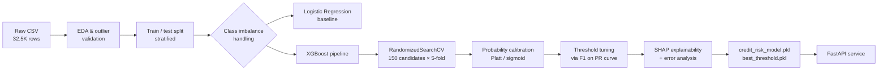

<div align="center">

# 🏦 Credit Ledger — Credit Risk Analysis & Prediction

**An end-to-end machine learning system that predicts loan default risk from applicant and loan data — from raw CSV to a calibrated XGBoost model served behind a FastAPI backend with a live web UI.**

[](https://www.python.org/)
[](https://fastapi.tiangolo.com/)
[](https://xgboost.readthedocs.io/)
[](https://scikit-learn.org/)
[](#-license)

</div>

---

## 📖 Overview

**Credit Ledger** answers a single underwriting question: *given an applicant's profile and the loan they're requesting, how likely are they to default?*

The project covers the full lifecycle of a real-world credit risk model:

1. **Exploratory data analysis & cleaning** of ~32.5K historical loan records
2. **Handling severe class imbalance** (defaults are the minority class)
3. **Training and comparing** Logistic Regression and XGBoost pipelines
4. **Hyperparameter tuning** with `RandomizedSearchCV` (750 fits, optimized for average precision)
5. **Probability calibration** so the model's output can be trusted as an actual probability, not just a ranking score
6. **Threshold optimization** to pick the operating point that best balances precision and recall
7. **Explainability** via SHAP (local + global feature attribution) and false positive/negative analysis
8. **Deployment** as a FastAPI microservice with a hand-built, single-page "ledger" UI for interactive risk assessment

---

## ✨ Demo — The Ledger UI

The `static/` app is a themed, document-style form (dubbed *"Credit Ledger"*) that walks through applicant details, loan terms, and credit bureau history, then renders the model's verdict as an animated risk gauge with a **LOW RISK / HIGH RISK** stamp.

```
┌─────────────────────────────────────────────┐
│  Credit Ledger                    ● service ready │
│  An underwriting desk for consumer loans     │
├─────────────────────────────────────────────┤
│  01 — Applicant                              │
│      Age · Income · Home ownership · Tenure  │
│                                               │
│  02 — Loan request                           │
│      Purpose · Grade · Amount · Rate · Ratio │
│                                               │
│  03 — Credit bureau file                     │
│      Prior default · Credit history length   │
│                                               │
│              [ Assess risk ]                 │
├─────────────────────────────────────────────┤
│        ◔ 12.4%  default probability          │
│              [ LOW RISK ]                     │
└─────────────────────────────────────────────┘
```

Every field maps 1:1 to a feature the model was trained on, and the loan-to-income ratio auto-calculates as you type.

---

## 🧠 Modeling Approach

### Dataset

| | |
|---|---|
| **Source file** | `credit_risk_dataset.csv` |
| **Rows** | ~32,581 loan applications |
| **Target** | `loan_status` (`0` = repaid, `1` = defaulted) |
| **Features** | 11 applicant, loan, and credit-bureau attributes |

<details>
<summary><strong>Feature dictionary</strong></summary>

| Feature | Description |
|---|---|
| `person_age` | Applicant's age (years) |
| `person_income` | Annual income |
| `person_home_ownership` | `RENT`, `MORTGAGE`, `OWN`, `OTHER` |
| `person_emp_length` | Employment length (years) |
| `loan_intent` | Purpose: `PERSONAL`, `EDUCATION`, `MEDICAL`, `VENTURE`, `HOMEIMPROVEMENT`, `DEBTCONSOLIDATION` |
| `loan_grade` | Internal credit grade, `A`–`G` |
| `loan_amnt` | Requested loan amount |
| `loan_int_rate` | Interest rate (%) |
| `loan_percent_income` | Loan amount as a fraction of annual income |
| `cb_person_default_on_file` | Prior default on record (`Y`/`N`) |
| `cb_person_cred_hist_length` | Length of credit history (years) |

</details>

### Pipeline



**Key decisions:**

- **Class imbalance** — the minority (default) class is under-represented ~3.6:1. Logistic Regression uses `class_weight`; XGBoost uses a manually computed `scale_pos_weight` (≈ 3.63), since it has no built-in weighting.
- **Preprocessing** — two separate `ColumnTransformer` pipelines: one with median imputation + `StandardScaler` for Logistic Regression (a scale-sensitive linear model), and one with median imputation only for XGBoost (tree-based models don't need feature scaling). Categorical columns are imputed with a constant `"Missing"` value and one-hot encoded in both.
- **Model selection** — XGBoost was chosen as the final model over Logistic Regression for its stronger discriminative performance on this tabular, non-linear feature set.
- **Hyperparameter tuning** — `RandomizedSearchCV` over 150 candidate configurations × 5-fold stratified CV (750 fits total), optimizing **average precision** (better suited than accuracy for an imbalanced target).
- **Calibration** — the tuned model's raw scores are recalibrated with `CalibratedClassifierCV` (sigmoid/Platt scaling, 5-fold), so `default_probability` in the API response reflects a genuine probability rather than an arbitrary confidence score.
- **Decision threshold** — rather than defaulting to 0.5, the threshold that maximizes F1 on the precision–recall curve is computed *after* calibration and persisted separately (`best_threshold.pkl`), so it's tuned specifically for the deployed probability scale.
- **Explainability** — SHAP is used for both **global** feature importance (what drives risk across the whole portfolio) and **local** explanations (why a specific applicant was flagged), plus a dedicated pass analyzing false positives and false negatives to understand where the model struggles.

### Results

| Stage | Metric | Score |
|---|---|---|
| Hyperparameter search (CV) | Average Precision | **0.90** |
| Tuned XGBoost @ default threshold | Accuracy / Precision / Recall / F1 (class 1) | 0.92 / 0.82 / 0.81 / 0.81 |
| Tuned XGBoost @ optimized threshold (0.69) | Accuracy / Precision / Recall / F1 (class 1) | **0.94** / **0.95** / 0.74 / 0.83 |

> The optimized threshold trades some recall for a large precision gain — appropriate for an underwriting context where a false "low risk" verdict (approving a defaulter) is typically costlier than a false "high risk" verdict (declining a good applicant).
>
> The final threshold shipped with the model (`best_threshold.pkl`) is recomputed **after calibration**, on the calibrated probability scale — currently **≈ 0.647**.

All of this — EDA, class imbalance handling, both pipelines, tuning, calibration, threshold search, SHAP, and error analysis — lives in **[`credit_risk.ipynb`](credit_risk.ipynb)**.

---

## 🏗️ Project Structure

```
credit_risk_analysis/
├── credit_risk.ipynb          # Full modeling notebook: EDA → training → tuning → SHAP
├── credit_risk_dataset.csv    # Source dataset (~32.5K loan records)
├── credit_risk_model.pkl      # Final calibrated XGBoost pipeline (joblib)
├── best_threshold.pkl         # Optimized decision threshold (joblib)
├── main.py                    # FastAPI application (/predict endpoint + static hosting)
├── requirements.txt           # Python dependencies
└── static/                    # Frontend — "Credit Ledger" single-page app
    ├── index.html
    ├── style.css
    └── script.js
```

---

## 🚀 Getting Started

### Prerequisites

- Python 3.10+
- pip

### Installation

```bash
git clone https://github.com/sumran58/credit_risk_analysis.git
cd credit_risk_analysis
pip install -r requirements.txt
```

### Run the app

```bash
uvicorn main:app --reload
```

Then open **http://127.0.0.1:8000** — the FastAPI app serves the `static/` frontend directly at `/`, with the prediction API at `/predict`.

> On startup, the app loads `credit_risk_model.pkl` and `best_threshold.pkl` once into memory (via a `lifespan` context manager) and keeps them resident for the life of the process, rather than reloading them on every request.

---

## 🔌 API Reference

### `POST /predict`

Scores a single loan application and returns a default probability, the binary decision, and the threshold used to make it.

<details>
<summary><strong>Request body</strong></summary>

```json
{
  "person_age": 30,
  "person_income": 600000,
  "person_home_ownership": "RENT",
  "person_emp_length": 5,
  "loan_intent": "PERSONAL",
  "loan_grade": "B",
  "loan_amnt": 100000,
  "loan_int_rate": 11.5,
  "loan_percent_income": 0.17,
  "cb_person_default_on_file": "N",
  "cb_person_cred_hist_length": 6
}
```

</details>

<details>
<summary><strong>Response</strong></summary>

```json
{
  "default_probability": 0.1243,
  "default_prediction": 0,
  "threshold": 0.6469815820630676,
  "Result": "Low Risk"
}
```

</details>

`default_prediction` is `1` ("High Risk") whenever `default_probability >= threshold`, and `0` ("Low Risk") otherwise.

Interactive OpenAPI docs are available at **`/docs`** once the server is running.

---

## 🖥️ Frontend

The `static/` folder is a dependency-free HTML/CSS/JS app (no build step) styled as a bank underwriting ledger:

- **Three-section form** — applicant details, loan request, and credit bureau file — mirroring the model's exact feature set
- **Live service status indicator**, pinged against `/openapi.json` on load
- **Auto-computed loan-to-income ratio** as income/amount fields change
- **Animated risk gauge** (SVG) that fills to the predicted probability, with a threshold tick mark showing where the model's decision boundary sits
- **Risk stamp** (`LOW RISK` / `HIGH RISK`) with a distinct visual treatment for high-risk verdicts

---

## 🛠️ Tech Stack

| Layer | Tools |
|---|---|
| **Modeling** | pandas, NumPy, scikit-learn, XGBoost, SHAP |
| **Serving** | FastAPI, Pydantic, Uvicorn |
| **Persistence** | joblib |
| **Frontend** | Vanilla HTML / CSS / JavaScript (no framework) |

---

## 📄 License

This project is licensed under the MIT License.

---

<div align="center">

Built as an exploration of the full credit risk modeling lifecycle — from imbalanced tabular data to a calibrated, explainable, served ML model.

</div>
